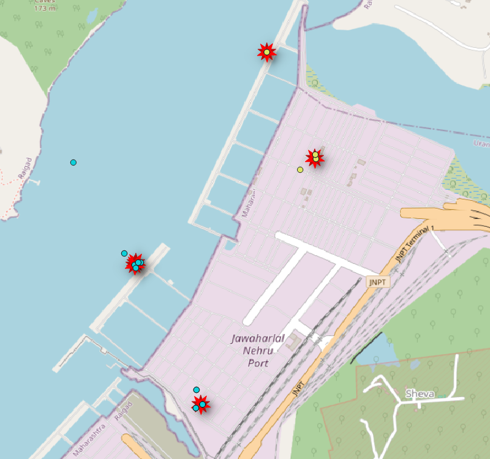
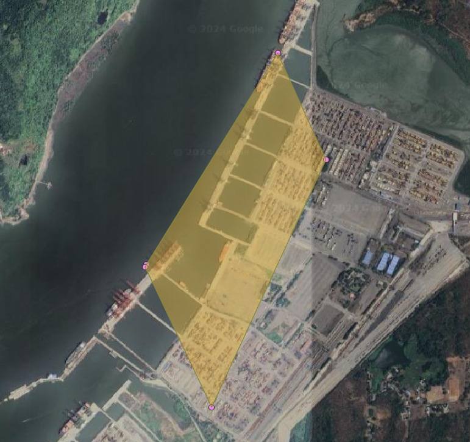

## ZOI Detection and Initial Shape Construction

The initial phase of this system focuses on the detection of Zones of Interest (ZOIs) and the construction of their initial shapes. This critical step utilizes advanced spatio-temporal data analysis techniques, and we have developed a specialized algorithm for stops detection called STC-DBSCAN, which aims to enhance the identification process.

However, please note that the detailed implementation and methodology for this phase are not publicly visible due to a legal agreement with our TNTM partners. We appreciate your understanding and are committed to providing as much information as possible within these constraints.

### Example of extracted stops and initial ZOI Shape.

Below are examples of extracted stops along with the initial shape of ZOI:

  
  

Demonstrative video:

https://github.com/user-attachments/assets/7756778c-870a-4a24-9591-d6ad8716e167

